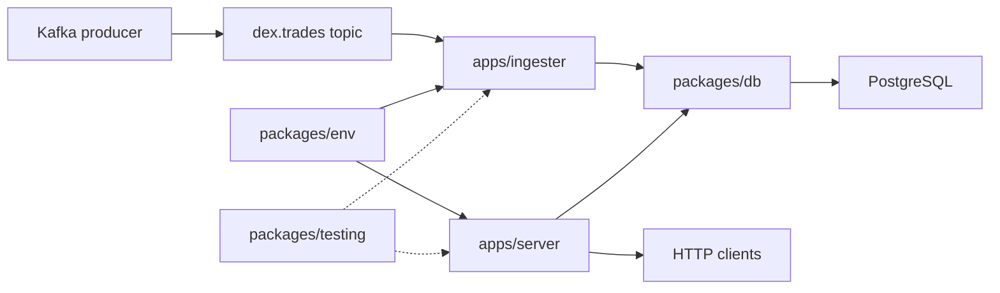

# Architecture

The workspace demonstrates one simple flow:



## Boundaries

### HTTP API

The server defines its routes with Effect HttpApi. Handlers are intentionally
thin: they read a service from context, run the operation, and translate
typed failures into response schemas.

### Kafka ingestion

The ingester owns the Kafka consumer lifecycle and batch coordination. Message
schemas are decoded at the boundary, then validated domain values flow into
the repository. Consumer concerns do not become database concerns.

### Persistence

The database package owns the source of truth for stored trades. Its client,
schema, migrations, and repositories are composed into the applications as
layers. Application services depend on repository capabilities, not on raw
database connections.

### Configuration

Environment variables are decoded once through Effect Config and exposed as
services. This makes configuration explicit in the layer graph and easy to
replace in tests.

## Dependency direction

```text
apps/server ─┐
apps/ingester ─┼──> packages/db
├──> packages/env
└──> packages/testing

packages/config ───> shared compiler and tooling defaults
```

The applications compose the system. Libraries provide capabilities but do
not start processes or reach into application-specific modules.

## Operational shape

The local runtime has two long-lived processes and two infrastructure
dependencies:

1. Kafka receives trade events.
2. The ingester validates and persists them.
3. PostgreSQL provides durable state.
4. The HTTP API exposes health, readiness, and read models.

This shape leaves room for later work—backpressure, retries, observability,
reconciliation, and richer read models—without requiring the initial example
to hide those concerns behind a large framework.
